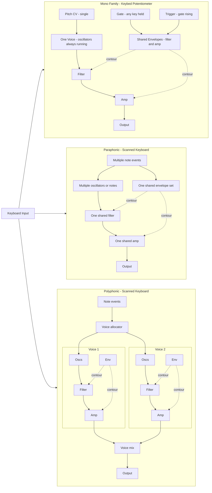

# Subsequent 37 Synthesizer Specification

This document outlines the visual and functional specification for the Subsequent 37 software synthesizer - a faithful recreation of the Moog Subsequent 37 paraphonic analog synthesizer.

## 1. Visual Theme
- **Background**: Blue-gray charcoal (#2B3A45) - matching Moog hardware panels.
- **Primary Accent**: White (#FFFFFF) for labels and active indicators.
- **Secondary Accent**: Orange-Red (#FF4500) for LED indicators and button highlights.
- **Text**: 
  - Section Headers: Bold, White, Uppercase.
  - Primary Labels: White, Sans-serif, hardware silk-screen style.
  - Secondary Labels/Values: Light gray, smaller font size.
- **Knobs**: Hardware-style circular white/gray knobs with realistic gradients, shadows, and black pointer lines.
- **Sections**: Defined by subtle dark panels (#1E2A32) with minimal borders.

## 2. Layout Overview
The interface replicates the Moog Subsequent 37 hardware layout with sections for oscillators, mixer, filter, envelopes, and modulation.

### 2.1 Left Sidebar (Master Control)
- **Output Section**:
  - `HOLD` button.
  - `VOLUME` knob: Default 0dB (Range: -60dB to +10dB).
  - `VOICES` selector (paraphonic: 1-2 voices).
  - `DAW`, `BPM`, `MPE` toggle buttons.
  - `MASTER FREQ` knob: Default A=440Hz (Range: 410Hz to 460Hz).
  - `TRANSPOSE` selector.
  - `MASTER TUNE` knob: Default 0 cents (Range: -100 to +100 cents).
- **Branding**: "SUBSEQUENT" (Large White), "37" (White), "PARAPHONIC ANALOG SYNTHESIZER" (Light Gray).

### 2.2 Oscillator Section
- **Osc 1 & 2**:
  - `WAVE` selector knob: Default Sawtooth. (Sine, Triangle, Sawtooth, Square, Pulse waveforms).
  - `OCTAVE` selector knob: Default 8' (Values: 16', 8', 4', 2'). Snaps to values.
- **Global Osc Controls**:
  - `HARD SYNC` toggle - syncs Osc 2 to Osc 1.
  - `KEY SYNC` toggle - resets oscillator phase on note-on.
  - `PARA MODE` toggle - enables paraphonic mode.
  - `FREQUENCY` knob (-7 to +7 semitones).
  - `BEAT RATE` knob (-3.5Hz to +3.5Hz) - detunes Osc 2 relative to Osc 1.

### 2.3 Mixer Section
- Vertical stack of knobs with orange/red LEDs:
  - `OSC 1`: Default 0dB (Range: -60dB to +10dB). LED indicator.
  - `SUB 1 SQUARE`: Default -60dB (Range: -60dB to +10dB). Square wave 1 octave below Osc 1.
  - `OSC 2`: Default -60dB (Range: -60dB to +10dB). LED indicator.
  - `NOISE`: Default -60dB (Range: -60dB to +10dB). White noise generator.
  - `RETURN` (External): Default -60dB (Range: -60dB to +10dB).

### 2.4 Filter Section
- `CUTOFF`: Large central knob. Default 100% (20kHz) (Range: 20Hz to 20kHz).
- `RESONANCE` knob: Default 0% (Range: 0% to 100%). High resonance causes self-oscillation.
- `DRIVE` knob: Default 1.0 (Range: 1.0 to 10.0). Adds saturation and warmth.
- `EG DEPTH` knob (-5 to +5) - envelope modulation amount.
- `KEY TRK` knob (0 to 2:1) - keyboard tracking amount.
- **Characteristics**: Moog 24dB/oct Ladder Filter - the iconic Moog sound.

### 2.5 Envelope Sections
- **Envelope 1 (Filter, Mod)**:
  - `ATTACK`, `DECAY`, `RELEASE`: Default 0.003s (Range: 0.003s to 10sec).
  - `SUSTAIN`: Default 100% (Range: 0% to 100%).
- **Envelope 2 (Amplitude)**:
  - `ATTACK`, `DECAY`, `RELEASE`: Default 0.003s (Range: 0.003s to 10sec).
  - `SUSTAIN`: Default 100% (Range: 0% to 100%).
- **Behavior**: Classic ADSR with exponential curves.
- **Secondary Controls**: `DELAY`, `HOLD`, `VEL DEPTH`, `KEY TRK`.
- **Toggles**: `RETRIG`, `RESET`, `SYNC`, `CYCLE`, `HOLD ON`, `EXP CURV`.

### 2.6 Modulation Sections (MOD1 & MOD2)
Two identical modulation sources.
- **LFO**: `LFO RATE` (0.1 to 100Hz), `WAVE` selector (Triangle, Saw, Square, etc.).
- **Sync**: `x10`, `SYNC`, `KEY SYNC` buttons.
- **Clock**: `CLOCK SYNC` (e.g., 4 WH NOTES), `SWING` knob.
- **Depths**: `PITCH DEPTH`, `FILTER DEPTH`, `MOD DEPTH`.
- **Performance**: `WHEEL`, `AFTERTOUCH`, `VELOCITY`.
- **Routing**: `1`, `1+2`, `2` selection with orange LEDs.

### 2.7 Bottom Utility Row
- **GLISS**:
  - `TIME` knob - portamento/glide time.
  - `RTE`, `TME`, `LOG` mode toggles.
  - `ON GAT LEG` toggle.
- **ARPEGGIATOR**:
  - `ON/ALT/DIR` and `END/INVERT` switches.
  - `RATE` knob, `RANGE` selector.
  - `GATE` knob, `PATTERN` selector.
  - `SWING` horizontal slider.

## 3. Component Behavior
- **Knobs**: White/gray hardware-style with black pointer lines. Support vertical dragging.
- **Toggles**: Glow orange/red when active.
- **LEDs**: Small circular indicators (Orange/Red).
- **Sections**: Dark blue-gray panels with subtle highlights.

## 4. Signal Path

## 5. Key Features of the Subsequent 37
- **Paraphonic Mode**: Can play up to 2 notes simultaneously with shared filter and VCA.
- **Moog Ladder Filter**: The legendary 4-pole (24dB/oct) lowpass filter that defines the Moog sound.
- **Oscillator Hard Sync**: Osc 2 can be synced to Osc 1 for harmonic-rich timbres.
- **Extensive Modulation**: 2 LFOs can modulate pitch, filter, and other parameters.
- **Analog-Style Envelopes**: ADSR envelopes with exponential curves for natural attack and release.
- **Sub Oscillator**: Adds weight and depth with a square wave one octave below Osc 1.

## 6. Audio Characteristics
- **Warmth**: Moog filters add warmth and character to any sound source.
- **Punch**: Fast envelopes and resonant filters create punchy bass and lead sounds.
- **Smooth**: Analog-modeled oscillators with minimal aliasing.
- **Versatile**: From deep bass to screaming leads to lush pads.

## 7. Note Handling & Voice Architectures

Neon-37 supports multiple play modes that map to two fundamentally different “keyboard → synth” architectures.

### 7.1 Mono Architecture (Keybed-as-Potentiometer Model)

This models early monosynth behavior (e.g., Minimoog-style):

- **One pitch CV** at a time: the keybed behaves like a continuous resistive element, and the pressed key(s) define a single voltage.
- **One gate**: gate is HIGH if *any* key is held; gate is LOW only when *no* keys are held.
- **One trigger**: envelopes trigger on the gate rising edge (0 → 1), and do *not* retrigger while gate stays high.
- **Oscillators always running**: in Mono-L the engine keeps one voice active and retunes it (no new note allocation on legato pitch changes). **Oscillator phase is NOT reset on legato notes, ensuring a continuous waveform.**

Mono-L pitch priority is modeled as **lowest-note priority** (the pitch follows the lowest held key). Mono (retrigger) may use a different priority, but still remains a single-voice/gate system.

### 7.2 Scanned Keyboard Architecture (Para / Poly)

Modern keyboard scanning detects multiple simultaneous keys and produces discrete note-on/note-off events.

- **Para (paraphonic)**: multiple oscillators/notes can be active simultaneously but share **one filter, one VCA, and one set of envelopes** (shared amp/filter contour). Envelopes are shared/gated by the aggregate key state. **In Para-L mode, oscillator phase IS reset on every note-on to ensure consistent attack transients for each voice in the chord.**
- **Poly (polyphonic)**: each voice has its own oscillators, filter, VCA, and envelopes (one contour per voice). Notes are allocated to voices by the voice allocator.

### 7.3 Architecture Diagram

